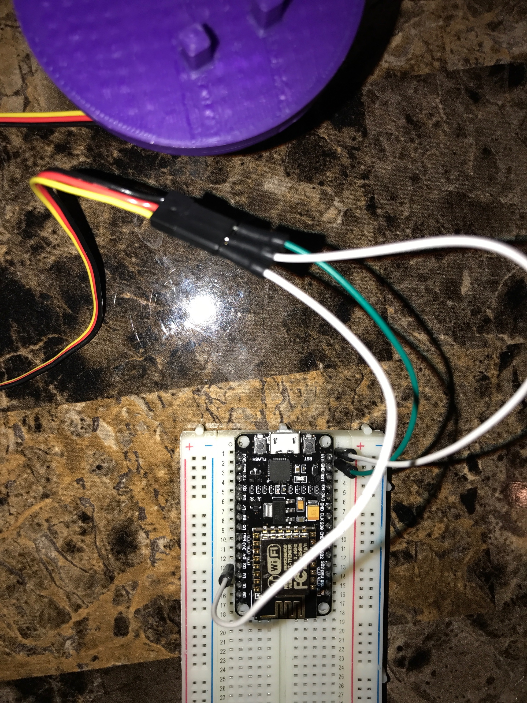
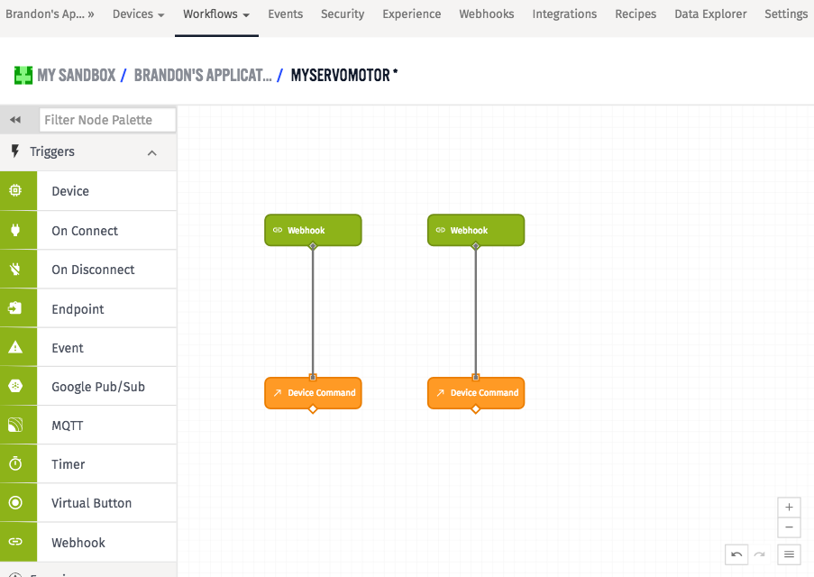
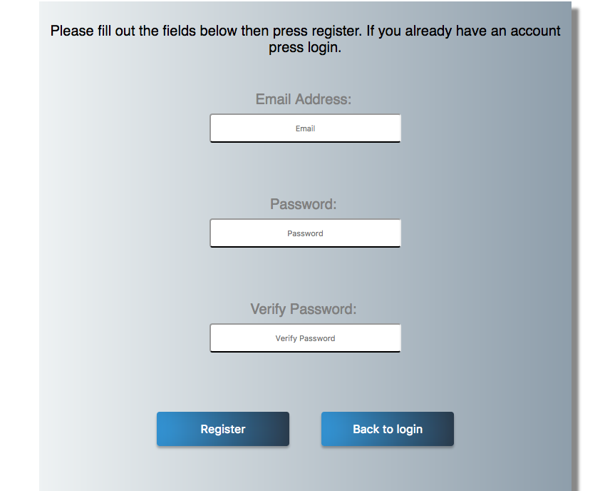
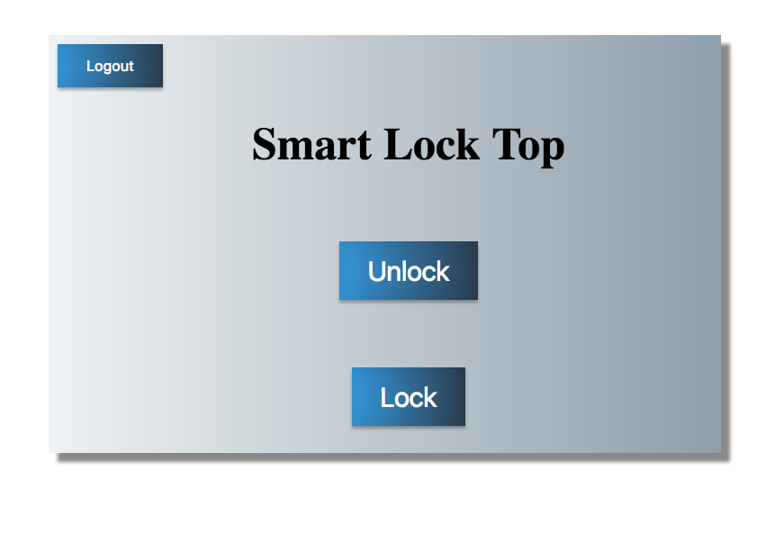

# smart-lock 

**[Here is an example of my Smart-Lock project.](https://www.youtube.com/watch?v=HcA8sy3OIL4&feature=youtu.be)**


# Materials
- **[NodeMCU Microcontroller](https://www.ebay.com/p/?iid=222176238324&&&chn=ps)** w/ breadboard
- **[Servo Motor](http://www.kr4.us/servo-large-full-rotation.html?gclid=Cj0KEQjwmIrJBRCRmJ_x7KDo-9oBEiQAuUPKMlA43kGovNUKK3wdQuSmmlrGXM2vgVta6RFsUPTlfocaAtkx8P8HAQ)**
- Dead Bolt Lock Holder (This is 3d printed, and attaches to the servo motor.)

# Set up nodeMCU Environment

- Connect the NodeMCU to the servo motor. (connect red wire to the VIN pin, the black wire to the GND pin, and the yellow wire to the D2 pin. 



- **[NodeMCU Setup](https://docs.losant.com/getting-started/losant-iot-dev-kits/environment-setup/)**
- Open the `arduinoCode.ino` file from the `arduinoCode` folder in the `myapp` directory.
- Adjust the Wifi and losant credentials. (The DEVICE_ID is located in the upper right corner of the applications tab in a grey box. You will get the ACCESS_KEY and ACCESS_SECRET after creating a losant account).
```
// WiFi credentials.
const char* WIFI_SSID = "";
const char* WIFI_PASS = "";

// Losant credentials.
const char* LOSANT_DEVICE_ID = "";
const char* LOSANT_ACCESS_KEY = "";
const char* LOSANT_ACCESS_SECRET = "";
```
- Click upload in the upper left hand corner of the Arduino IDE.
- Create a losant account and application.

**[How to create a losant account and application](https://docs.losant.com/getting-started/losant-iot-dev-kits/builder-kit/)**

(Stop after the "generate an Access Key" section)

# Create a webhook
 - Click the "webhook" button in the applications tap at the top of the page then click the "add webhook" button in the upper right corner of the page. 
- Name your webhook "unlock-button", then click "create webhook" at the bottom of the page.
- Copy the url next to the webhook you created.
- Go to the "main.js" file in the "javascripts" folder, in the "public" folder, in the "myapp" directory, and paste the webhook url in the get request for "#unlockButton."
- Click the "webhook" button in the applications tap at the top of the page then click the "add webhook" button in the upper right corner of the page. 
- Name your webhook "lock-button", then click "create webhook" at the bottom of the page.
- Copy the url next to the webhook you created.
- Go to the "main.js" file in the "Javascripts" folder, in the "public" folder, in the "myapp" directory, and paste the webhook url in the get request for "#lockButton."
```
/*------------------- Smart Lock Top Page ----------------------------------*/


$(document).ready(function() {

$('#logoutButton').click(function(){
	window.location.href = '/';
});

$('#unlockButton').click(function() {
  $.get("");
  alert('you unlocked the door');

});

$('#lockButton').click(function() {
  $.get("");
  alert('you locked the door');

});

});
```

# Create a workflow

Click the "workflow" button in the applications tab at the top of the page and select "create new workflow." You can name the workflow whatever you would like. Then begin to mimmic the workflow below.



- Click on the first webhook on the workflow and on the right hand side of the page, the webhook menu should appear.
- Scroll to the bottom and under choose hook, choose the "unlock-button" webhook.
- Click the device command connected to the "unlock-button" webhook and on the right hand side of the page, the device command menu should appear.
- On the menu, under "command name template" type "unlock"
- Click on the second webhook on the workflow and on the right hand side of the page, the webhook menu should appear
- Scroll to the bottom and under choose hook, choose the "lock-button" webhook.
- Click the device command connected to the "lock-button" webhook and on the right hand side of the page, the device command menu should appear.
- On the menu, under "command name template" type "lock."


# Install all dependencies

```bash
$ npm install
```
# Start 

```bash
$ node ./bin/www
```
smart-lock app starts at `http://localhost:3000/`

# How to login



Go to the register page and fill out all fields with the appropriate credenials and press register.
Then use the email address and password that you used to register to log in.

# How smart-lock works


The unlock and lock buttons use javascript to communicate with a nodeMCU microcontroller, that I have connected to a motor, to turn the device counter clockwise or clockwise depending on the command.
